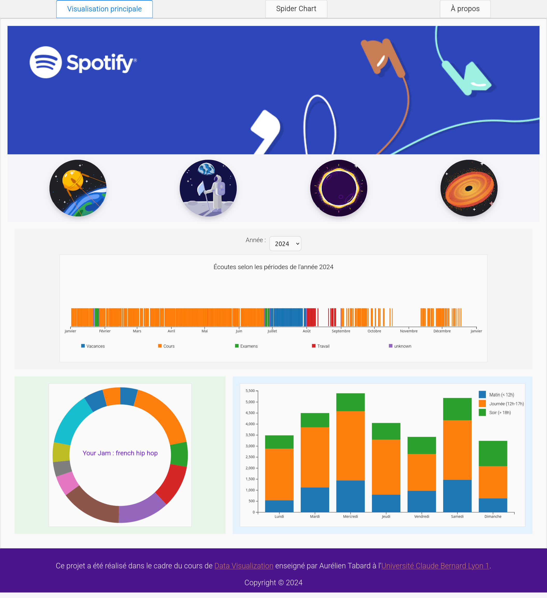

# Data visualisation : SpotHabits

    

## Description 

Ce site offre aux membres du groupe une plateforme interactive pour visualiser leurs données d'écoute musicales. Il met en évidence des informations clés comme le nombre d'écoutes, les genres musicaux favoris et les périodes propices à l'écoute, permettant une analyse claire et personnalisée des habitudes musicales.

L’objectif est d’explorer l’évolution des préférences musicales selon différents contextes, tels que les périodes de cours ou de travail, tout en comparant ces tendances avec celles d’autres utilisateurs. Les visualisations interactives rendent cette exploration intuitive et enrichissante, favorisant une compréhension approfondie des goûts et comportements musicaux.

## Accès au site web

Pour accéder à notre site web, veuillez visiter le lien suivant :  
[DataViz Site](http://dataviz-c075e3.pages.univ-lyon1.fr/)

## Suivi du développement

Pour suivre toutes les étapes du développement du site, veuillez consulter le lien suivant :  
[Cahier d'avancées](https://forge.univ-lyon1.fr/p2005244/DataViz/-/wikis/Cahier-d'avanc%C3%A9es)

## Description 

This project is a data visualisation website for a group of Spotify users. It offers an interactive platform for members of the group to view their music listening data. It highlights key information such as the number of listens, favorite music genres, and times of day for listening, enabling a clear and personalized analysis of music habits.

The goal is to explore the evolution of music preferences in different contexts, such as during classes or work, while comparing these trends with those of other users. The interactive visualizations make this exploration intuitive and enriching, fostering a deep understanding of music tastes and behaviors.

